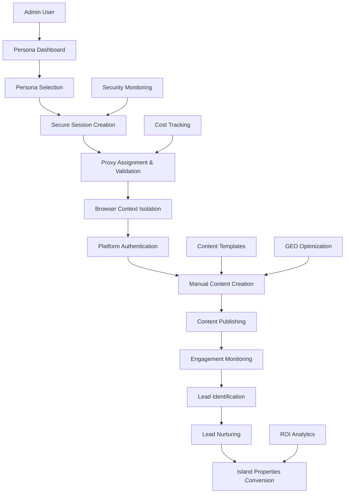

     # System Overview - Island Properties Lead Generation Platform

## Core System Architecture

### Manual Posting Focused Lead Generation System

```typescript
interface IslandPropertiesLeadGenerationSystem {
  // Primary Objective
  businessGoal: 'generate_qualified_real_estate_leads_for_island_properties';
  approach: 'authentic_filipino_personas_with_manual_posting';
  targetMarket: 'philippines_real_estate_buyers';
  
  // System Components
  coreComponents: {
    personaManagementEngine: 'multi_persona_orchestration_with_security';
    proxyInfrastructure: 'dedicated_residential_ips_per_persona';
    manualPostingFramework: 'human_controlled_content_creation';
    leadGenerationEngine: 'social_media_to_sales_funnel';
    geoOptimizationSystem: 'ai_citation_worthy_content_creation';
    securityLayer: 'browser_isolation_and_encryption';
  };
  
  // Business Model
  revenueStrategy: 'social_media_authority_to_real_estate_lead_conversion';
  costStructure: '6.35_usd_monthly_for_5_dedicated_proxies';
  roiTarget: 'positive_roi_through_qualified_lead_generation';
}
```

## System Architecture Overview

### High-Level Component Interaction

```typescript
interface SystemArchitecture {
  // User Interface Layer
  adminDashboard: {
    personaManagement: 'persona_switching_and_session_management';
    contentCreation: 'manual_content_creation_with_templates';
    leadTracking: 'social_media_to_island_properties_attribution';
    performanceAnalytics: 'roi_and_engagement_monitoring';
    securityMonitoring: 'proxy_health_and_browser_isolation_status';
  };
  
  // Business Logic Layer
  applicationServices: {
    personaOrchestrator: 'manage_5_buyer_personas_with_authentication';
    contentManagementSystem: 'templates_and_manual_customization';
    leadGenerationEngine: 'track_and_nurture_social_media_leads';
    geoOptimizationEngine: 'create_ai_citation_worthy_content';
    securityManager: 'browser_isolation_and_proxy_management';
  };
  
  // Infrastructure Layer
  technicalInfrastructure: {
    proxyService: 'proxy_cheap_5_dedicated_residential_ips';
    browserIsolation: 'playwright_with_fingerprint_randomization';
    database: 'postgresql_with_persona_specific_encryption';
    caching: 'redis_for_session_and_performance_optimization';
    monitoring: 'health_checks_and_security_event_tracking';
  };
}
```

### Data Flow Architecture



## Core System Components

### 1. Persona Management Engine

```typescript
class PersonaManagementEngine {
  private activePersonas: Map<string, PersonaSession> = new Map();
  private securityManager: SecurityManager;
  private proxyManager: ProxyManager;
  
  // Multi-Persona Orchestration
  async switchPersona(
    fromPersonaId: string | null,
    toPersonaId: string
  ): Promise<PersonaSwitchResult> {
    
    console.log(`🔄 Switching persona: ${fromPersonaId || 'none'} → ${toPersonaId}`);
    
    const startTime = Date.now();
    
    try {
      // 1. Safely end current persona session
      if (fromPersonaId) {
        await this.endPersonaSession(fromPersonaId);
      }
      
      // 2. Validate target persona readiness
      const persona = await this.validatePersonaReadiness(toPersonaId);
      
      // 3. Assign and validate dedicated proxy
      const proxyAssignment = await this.proxyManager.assignPersonaProxy(
        toPersonaId, 
        persona.primaryLocation
      );
      
      // 4. Create isolated browser context
      const browserContext = await this.createIsolatedBrowserContext(
        toPersonaId,
        proxyAssignment
      );
      
      // 5. Initialize manual posting environment
      const postingEnvironment = await this.initializePostingEnvironment(
        browserContext,
        persona
      );
      
      // 6. Create active session
      const session: PersonaSession = {
        personaId: toPersonaId,
        persona,
        proxyAssignment,
        browserContext,
        postingEnvironment,
        startedAt: new Date(),
        status: 'active',
        securityValidated: true,
        switchDuration: Date.now() - startTime
      };
      
      this.activePersonas.set(toPersonaId, session);
      
      // 7. Track persona switch for analytics
      await this.trackPersonaSwitch(fromPersonaId, toPersonaId, session.switchDuration);
      
      console.log(`✅ Persona switch completed in ${session.switchDuration}ms`);
      
      return {
        success: true,
        personaId: toPersonaId,
        switchDuration: session.switchDuration,
        proxyLocation: proxyAssignment.location,
        platformsReady: postingEnvironment.platformsReady,
        securityValidated: true
      };
      
    } catch (error) {
      console.error(`❌ Persona switch failed: ${error.message}`);
      
      return {
        success: false,
        personaId: toPersonaId,
        error: error.message,
        switchDuration: Date.now() - startTime
      };
    }
  }
  
  // Session State Management
  async getCurrentPersonaState(personaId: string): Promise<PersonaState> {
    const session = this.activePersonas.get(personaId);
    
    if (!session) {
      return {
        status: 'inactive',
        readyForPosting: false
      };
    }
    
    // Real-time validation of session health
    const healthCheck = await this.validateSessionHealth(session);
    
    return {
      status: session.status,
      readyForPosting: healthCheck.healthy,
      activePlatforms: session.postingEnvironment.activePlatforms,
      proxyHealth: healthCheck.proxyHealth,
      browserHealth: healthCheck.browserHealth,
      sessionDuration: Date.now() - session.startedAt.getTime(),
      lastActivity: session.lastActivity,
      securityStatus: healthCheck.securityStatus
    };
  }
  
  // Platform Integration Coordination
  async coordinatePlatformLogin(
    personaId: string,
    platformType: string
  ): Promise<PlatformLoginResult> {
    
    const session = this.activePersonas.get(personaId);
    if (!session) {
      throw new Error('No active persona session');
    }
    
    // Platform-specific login orchestration
    const platformManager = this.getPlatformManager(platformType);
    
    const loginResult = await platformManager.performManualLogin(
      session.browserContext,
      session.persona,
      platformType
    );
    
    // Update session state
    if (loginResult.success) {
      session.postingEnvironment.activePlatforms.push(platformType);
      session.lastActivity = new Date();
    }
    
    // Track platform authentication
    await this.trackPlatformAuthentication(
      personaId,
      platformType,
      loginResult.success
    );
    
    return loginResult;
  }
}

interface PersonaSession {
  personaId: string;
  persona: PersonaProfile;
  proxyAssignment: ProxyAssignment;
  browserContext: BrowserContext;
  postingEnvironment: PostingEnvironment;
  startedAt: Date;
  lastActivity?: Date;
  status: 'active' | 'idle' | 'ending';
  securityValidated: boolean;
  switchDuration: number;
}

interface PostingEnvironment {
  platformsReady: string[];
  activePlatforms: string[];
  contentTemplatesLoaded: boolean;
  leadGenerationTracking: boolean;
  geoOptimizationEnabled: boolean;
}
```

### 2. Manual Posting Framework

```typescript
class ManualPostingFramework {
  private contentTemplateLibrary: ContentTemplateLibrary;
  private geoOptimizer: GEOOptimizer;
  private leadTracker: LeadTracker;
  
  // Human-Controlled Content Creation
  async createManualPost(
    personaId: string,
    contentRequest: ManualContentRequest
  ): Promise<ManualPostResult> {
    
    console.log(`✍️ Creating manual post for persona ${personaId}`);
    
    try {
      // 1. Load persona context and templates
      const persona = await this.getPersonaProfile(personaId);
      const relevantTemplates = await this.contentTemplateLibrary
        .getTemplatesForPersona(persona.buyerPersonaType);
      
      // 2. Provide content creation assistance
      const contentAssistance = await this.provideContentAssistance(
        contentRequest,
        persona,
        relevantTemplates
      );
      
      // 3. Apply GEO optimization suggestions
      const geoOptimizations = await this.geoOptimizer
        .suggestOptimizations(contentRequest.content, persona);
      
      // 4. Present unified content creation interface
      return {
        personaContext: persona,
        templateSuggestions: relevantTemplates,
        contentAssistance,
        geoOptimizations,
        readyForManualCreation: true,
        estimatedCreationTime: this.estimateCreationTime(contentRequest.complexity)
      };
      
    } catch (error) {
      console.error(`❌ Manual post creation setup failed: ${error.message}`);
      throw error;
    }
  }
  
  // Content Template System for Manual Customization
  async getPersonalizedContentTemplate(
    templateId: string,
    personaId: string,
    customizations: TemplateCustomizations
  ): Promise<PersonalizedTemplate> {
    
    const baseTemplate = await this.contentTemplateLibrary.getTemplate(templateId);
    const persona = await this.getPersonaProfile(personaId);
    
    // Apply persona-specific customizations
    const personalizedTemplate = {
      ...baseTemplate,
      
      // Persona voice application
      content: this.applyPersonaVoice(baseTemplate.content, persona),
      
      // Local reference insertion
      localReferences: this.insertLocalReferences(
        baseTemplate.localReferenceSlots,
        persona.primaryLocation
      ),
      
      // GEO optimization integration
      geoElements: await this.geoOptimizer.enhanceTemplate(
        baseTemplate,
        persona.realEstateExpertise
      ),
      
      // Lead generation hooks
      conversionHooks: this.personalizeConversionHooks(
        baseTemplate.conversionHooks,
        persona.buyerPersonaType
      ),
      
      // Customization guidance
      customizationTips: this.generateCustomizationTips(
        baseTemplate,
        persona,
        customizations
      )
    };
    
    return personalizedTemplate;
  }
  
  // Manual Posting Execution Support
  async supportManualPosting(
    personaId: string,
    platformType: string,
    postContent: ManualPostContent
  ): Promise<PostingSupportResult> {
    
    const session = await this.getActiveSession(personaId);
    
    // Provide technical support for manual posting
    const postingSupport = {
      // Browser automation assistance
      browserHelper: await this.createBrowserHelper(
        session.browserContext,
        platformType
      ),
      
      // Platform-specific guidance
      platformGuidance: await this.getPlatformGuidance(
        platformType,
        postContent
      ),
      
      // Content validation
      contentValidation: await this.validateContent(
        postContent,
        platformType,
        session.persona
      ),
      
      // Lead generation tracking setup
      leadTrackingSetup: await this.leadTracker.setupPostTracking(
        personaId,
        platformType,
        postContent.leadGenerationIntent
      ),
      
      // Security validation
      securityChecks: await this.performSecurityChecks(
        session,
        postContent
      )
    };
    
    return {
      supportTools: postingSupport,
      readyToPost: postingSupport.contentValidation.valid && 
                   postingSupport.securityChecks.passed,
      recommendations: postingSupport.contentValidation.recommendations
    };
  }
}

interface ManualContentRequest {
  contentType: 'educational' | 'personal_story' | 'market_insight' | 'community_engagement';
  topic: string;
  buyerPersonaTarget: string[];
  platformTargets: string[];
  leadGenerationGoal: 'awareness' | 'consideration' | 'conversion';
  complexity: 'simple' | 'moderate' | 'complex';
  urgency: 'immediate' | 'scheduled' | 'draft';
}

interface ManualPostContent {
  text: string;
  media?: MediaFile[];
  hashtags: string[];
  platformSettings: any;
  leadGenerationIntent: string;
  geoOptimizationLevel: 'high' | 'medium' | 'low';
}
```

### 3. Lead Generation Engine

```typescript
class LeadGenerationEngine {
  private socialMediaTrackers: Map<string, PlatformLeadTracker>;
  private conversionAnalyzer: ConversionAnalyzer;
  private roiCalculator: ROICalculator;
  
  // Social Media to Island Properties Funnel
  async trackLeadGeneration(
    personaId: string,
    platformType: string,
    interactionType: LeadInteractionType,
    interactionData: any
  ): Promise<LeadGenerationResult> {
    
    console.log(`🎯 Tracking lead generation: ${interactionType} on ${platformType}`);
    
    try {
      // 1. Classify lead potential
      const leadClassification = await this.classifyLeadPotential(
        interactionType,
        interactionData,
        personaId
      );
      
      if (leadClassification.potential === 'none') {
        return { leadGenerated: false, reason: 'No lead potential identified' };
      }
      
      // 2. Create lead record
      const leadRecord = await this.createLeadRecord({
        personaId,
        platformType,
        interactionType,
        interactionData,
        leadQuality: leadClassification.quality,
        buyerPersonaMatch: leadClassification.buyerPersonaMatch,
        timestamp: new Date()
      });
      
      // 3. Initialize lead nurturing
      const nurturingPlan = await this.createLeadNurturingPlan(
        leadRecord,
        leadClassification
      );
      
      // 4. Set up conversion tracking
      const conversionTracking = await this.setupConversionTracking(
        leadRecord.id,
        nurturingPlan
      );
      
      // 5. Calculate lead value
      const leadValue = await this.calculateLeadValue(
        leadClassification,
        personaId
      );
      
      // 6. Update persona performance metrics
      await this.updatePersonaMetrics(personaId, {
        leadsGenerated: 1,
        totalLeadValue: leadValue.estimatedValue,
        leadQualityScore: leadClassification.quality
      });
      
      return {
        leadGenerated: true,
        leadId: leadRecord.id,
        leadQuality: leadClassification.quality,
        estimatedValue: leadValue.estimatedValue,
        nurturingPlan,
        conversionTracking: conversionTracking.trackingId,
        nextSteps: nurturingPlan.immediateActions
      };
      
    } catch (error) {
      console.error(`❌ Lead generation tracking failed: ${error.message}`);
      return { leadGenerated: false, error: error.message };
    }
  }
  
  // Lead Nurturing and Conversion
  async executeLeadNurturing(
    leadId: string,
    nurturingAction: NurturingAction
  ): Promise<NurturingResult> {
    
    const lead = await this.getLeadRecord(leadId);
    const persona = await this.getPersonaProfile(lead.personaId);
    
    try {
      let nurturingResult: NurturingResult;
      
      switch (nurturingAction.type) {
        case 'follow_up_message':
          nurturingResult = await this.sendFollowUpMessage(
            lead,
            persona,
            nurturingAction.data
          );
          break;
          
        case 'provide_educational_content':
          nurturingResult = await this.shareEducationalContent(
            lead,
            persona,
            nurturingAction.data
          );
          break;
          
        case 'invite_to_consultation':
          nurturingResult = await this.inviteToConsultation(
            lead,
            nurturingAction.data
          );
          break;
          
        case 'direct_island_properties_referral':
          nurturingResult = await this.referToIslandProperties(
            lead,
            nurturingAction.data
          );
          break;
          
        default:
          throw new Error(`Unknown nurturing action: ${nurturingAction.type}`);
      }
      
      // Update lead status and nurturing history
      await this.updateLeadProgress(leadId, nurturingResult);
      
      return nurturingResult;
      
    } catch (error) {
      console.error(`❌ Lead nurturing failed: ${error.message}`);
      return {
        success: false,
        error: error.message,
        leadId,
        actionType: nurturingAction.type
      };
    }
  }
  
  // ROI and Conversion Analytics
  async calculateLeadGenerationROI(
    timeframe: 'daily' | 'weekly' | 'monthly' | 'quarterly'
  ): Promise<LeadGenerationROIReport> {
    
    const timeframeCosts = await this.calculateTimeframeCosts(timeframe);
    const leadGenerationResults = await this.getLeadGenerationResults(timeframe);
    const conversionResults = await this.getConversionResults(timeframe);
    
    // Calculate ROI metrics
    const roiMetrics = {
      // Cost Analysis
      totalCosts: timeframeCosts.proxyCosts + timeframeCosts.timeInvestment,
      proxyCosts: timeframeCosts.proxyCosts,
      timeInvestmentCost: timeframeCosts.timeInvestment,
      
      // Lead Generation Performance
      totalLeadsGenerated: leadGenerationResults.totalLeads,
      qualifiedLeadsGenerated: leadGenerationResults.qualifiedLeads,
      leadConversionRate: leadGenerationResults.qualifiedLeads / leadGenerationResults.totalLeads,
      
      // Revenue Attribution
      totalAttributedRevenue: conversionResults.totalRevenue,
      averageDealValue: conversionResults.averageDealValue,
      conversionRate: conversionResults.conversions / leadGenerationResults.qualifiedLeads,
      
      // ROI Calculations
      revenueROI: (conversionResults.totalRevenue - timeframeCosts.total) / timeframeCosts.total,
      costPerLead: timeframeCosts.total / leadGenerationResults.totalLeads,
      costPerQualifiedLead: timeframeCosts.total / leadGenerationResults.qualifiedLeads,
      costPerConversion: timeframeCosts.total / conversionResults.conversions,
      
      // Pipeline Analysis
      pipelineValue: conversionResults.pipelineValue,
      pipelineROI: conversionResults.pipelineValue / timeframeCosts.total
    };
    
    // Platform-specific breakdown
    const platformROI = await this.calculatePlatformSpecificROI(timeframe);
    
    // Persona performance analysis
    const personaROI = await this.calculatePersonaSpecificROI(timeframe);
    
    return {
      timeframe,
      period: this.getTimeframePeriod(timeframe),
      overallROI: roiMetrics,
      platformBreakdown: platformROI,
      personaBreakdown: personaROI,
      recommendations: await this.generateROIRecommendations(roiMetrics)
    };
  }
}

interface LeadInteractionType {
  type: 'direct_message' | 'comment_inquiry' | 'post_engagement' | 'profile_visit';
  quality: 'high' | 'medium' | 'low';
  urgency: 'immediate' | 'interested' | 'researching';
}

interface LeadGenerationResult {
  leadGenerated: boolean;
  leadId?: string;
  leadQuality?: number;
  estimatedValue?: number;
  nurturingPlan?: NurturingPlan;
  conversionTracking?: string;
  nextSteps?: string[];
  reason?: string;
  error?: string;
}

interface NurturingPlan {
  leadId: string;
  buyerPersonaType: string;
  nurturingStage: 'initial' | 'engaged' | 'qualified' | 'hot';
  immediateActions: string[];
  scheduledActions: ScheduledAction[];
  conversionGoals: string[];
  timelineToConversion: string;
}
```

### 4. GEO Optimization System

```typescript
class GEOOptimizationSystem {
  private contentAnalyzer: ContentAnalyzer;
  private aiCitationTracker: AICitationTracker;
  private authorityBuilder: AuthorityBuilder;
  
  // AI Citation-Worthy Content Creation
  async optimizeContentForGEO(
    content: string,
    persona: PersonaProfile,
    targetQueries: string[]
  ): Promise<GEOOptimizedContent> {
    
    console.log(`🎯 Optimizing content for GEO - Target queries: ${targetQueries.length}`);
    
    try {
      // 1. Analyze content for AI citation potential
      const citationAnalysis = await this.contentAnalyzer.analyzeCitationPotential(
        content,
        targetQueries
      );
      
      // 2. Enhance authority signals
      const authorityEnhancement = await this.authorityBuilder.enhanceContent(
        content,
        persona.realEstateExpertise,
        persona.primaryLocation
      );
      
      // 3. Optimize for question-answer format
      const qaOptimization = await this.optimizeForQuestionAnswer(
        content,
        targetQueries,
        persona.buyerPersonaType
      );
      
      // 4. Add local expertise signals
      const localExpertiseSignals = await this.addLocalExpertiseSignals(
        content,
        persona.primaryLocation,
        persona.localKnowledge
      );
      
      // 5. Structure for AI consumption
      const aiStructuring = await this.structureForAIConsumption(
        content,
        citationAnalysis.keyTopics
      );
      
      // 6. Generate supporting data points
      const supportingData = await this.generateSupportingDataPoints(
        content,
        persona.marketExpertise
      );
      
      const optimizedContent = {
        originalContent: content,
        optimizedContent: this.combineOptimizations(
          authorityEnhancement,
          qaOptimization,
          localExpertiseSignals,
          aiStructuring,
          supportingData
        ),
        
        geoOptimizations: {
          citationPotential: citationAnalysis.potential,
          authoritySignals: authorityEnhancement.signals,
          questionAnswerElements: qaOptimization.elements,
          localExpertiseElements: localExpertiseSignals.elements,
          supportingDataPoints: supportingData.dataPoints
        },
        
        targetQueries: targetQueries,
        estimatedCitationLikelihood: this.calculateCitationLikelihood(
          citationAnalysis,
          authorityEnhancement,
          qaOptimization
        ),
        
        improvementSuggestions: await this.generateImprovementSuggestions(
          content,
          citationAnalysis
        )
      };
      
      return optimizedContent;
      
    } catch (error) {
      console.error(`❌ GEO optimization failed: ${error.message}`);
      throw error;
    }
  }
  
  // Authority Building Content Strategy
  async buildPersonaAuthority(
    personaId: string,
    authorityFocus: AuthorityFocus
  ): Promise<AuthorityBuildingPlan> {
    
    const persona = await this.getPersonaProfile(personaId);
    
    // Create comprehensive authority building strategy
    const authorityPlan = {
      personaId,
      authorityFocus,
      
      // Content Pillars for Authority
      contentPillars: [
        {
          pillar: 'Philippines Real Estate Market Expertise',
          topics: [
            'Market trends and analysis',
            'Investment opportunities by region',
            'Legal and regulatory updates',
            'Price predictions and forecasts'
          ],
          contentFrequency: 'weekly',
          citationPotential: 'very_high'
        },
        {
          pillar: 'Local Geographic Expertise',
          topics: [
            `Living in ${persona.primaryLocation}`,
            'Infrastructure development updates',
            'Community and lifestyle insights',
            'Transportation and accessibility'
          ],
          contentFrequency: 'bi_weekly',
          citationPotential: 'high'
        },
        {
          pillar: 'Buyer Education and Guidance',
          topics: [
            'First-time buyer guides',
            'Foreign buyer requirements',
            'Financing options and strategies',
            'Investment ROI calculations'
          ],
          contentFrequency: 'weekly',
          citationPotential: 'very_high'
        }
      ],
      
      // Authority Metrics Tracking
      authorityMetrics: {
        currentAuthorityScore: await this.calculateCurrentAuthorityScore(persona),
        targetAuthorityScore: 85, // 0-100 scale
        timeframeToTarget: '6_months',
        keyPerformanceIndicators: [
          'estimated_ai_citations',
          'content_engagement_quality',
          'expert_recognition_signals',
          'backlink_acquisition',
          'search_visibility_improvement'
        ]
      },
      
      // Content Calendar
      contentCalendar: await this.generateAuthorityContentCalendar(
        persona,
        authorityFocus
      ),
      
      // Success Measurements
      successMeasurements: [
        'Increased AI engine citations of persona content',
        'Growth in qualified lead generation',
        'Recognition as subject matter expert',
        'Improved search engine visibility',
        'Higher engagement quality scores'
      ]
    };
    
    return authorityPlan;
  }
}

interface GEOOptimizedContent {
  originalContent: string;
  optimizedContent: string;
  geoOptimizations: {
    citationPotential: number;
    authoritySignals: string[];
    questionAnswerElements: string[];
    localExpertiseElements: string[];
    supportingDataPoints: string[];
  };
  targetQueries: string[];
  estimatedCitationLikelihood: number;
  improvementSuggestions: string[];
}

interface AuthorityFocus {
  primaryExpertise: 'philippines_real_estate' | 'local_market_analysis' | 'investment_guidance';
  secondaryExpertise: string[];
  targetAudience: string[];
  competitorAnalysis: string[];
  uniqueValueProposition: string;
}
```

### 5. Security and Monitoring Layer

```typescript
class SecurityMonitoringLayer {
  private threatDetector: ThreatDetector;
  private complianceMonitor: ComplianceMonitor;
  private performanceMonitor: PerformanceMonitor;
  
  // Real-Time Security Monitoring
  async monitorSystemSecurity(): Promise<void> {
    console.log('🛡️ Starting comprehensive security monitoring...');
    
    setInterval(async () => {
      try {
        // 1. Proxy health and reputation monitoring
        const proxySecurityCheck = await this.threatDetector.checkProxyThreats();
        
        // 2. Browser isolation validation
        const browserSecurityCheck = await this.threatDetector.validateBrowserIsolation();
        
        // 3. Platform authentication security
        const authSecurityCheck = await this.threatDetector.checkAuthSecurity();
        
        // 4. Content policy compliance
        const complianceCheck = await this.complianceMonitor.checkContentCompliance();
        
        // 5. Suspicious activity detection
        const activityCheck = await this.threatDetector.detectSuspiciousActivity();
        
        // Process security results
        await this.processSecurityResults([
          proxySecurityCheck,
          browserSecurityCheck,
          authSecurityCheck,
          complianceCheck,
          activityCheck
        ]);
        
      } catch (error) {
        console.error('❌ Security monitoring error:', error);
        await this.handleSecurityMonitoringError(error);
      }
    }, 5 * 60 * 1000); // Every 5 minutes
  }
  
  // Performance and Cost Monitoring
  async monitorSystemPerformance(): Promise<SystemHealthReport> {
    const healthReport = {
      timestamp: new Date(),
      
      // System Performance
      systemPerformance: {
        personaSwitchTime: await this.measurePersonaSwitchTime(),
        contentCreationResponseTime: await this.measureContentCreationTime(),
        leadTrackingLatency: await this.measureLeadTrackingLatency(),
        databaseQueryPerformance: await this.measureDatabasePerformance()
      },
      
      // Infrastructure Health
      infrastructureHealth: {
        proxyHealth: await this.checkAllProxyHealth(),
        databaseHealth: await this.checkDatabaseHealth(),
        cacheHealth: await this.checkCacheHealth(),
        browserContextHealth: await this.checkBrowserContextHealth()
      },
      
      // Cost Monitoring
      costMonitoring: {
        dailyCosts: await this.calculateDailyCosts(),
        monthlyProjection: await this.calculateMonthlyProjection(),
        budgetUtilization: await this.calculateBudgetUtilization(),
        costOptimizationOpportunities: await this.identifyCostOptimizations()
      },
      
      // Lead Generation Performance
      leadGenerationHealth: {
        dailyLeadGeneration: await this.getDailyLeadStats(),
        leadQualityScore: await this.calculateLeadQualityScore(),
        conversionFunnelHealth: await this.analyzeConversionFunnel(),
        roiTrends: await this.analyzeROITrends()
      },
      
      // Security Status
      securityStatus: {
        threatLevel: await this.assessCurrentThreatLevel(),
        complianceStatus: await this.getComplianceStatus(),
        encryptionHealth: await this.validateEncryptionHealth(),
        accessControlStatus: await this.checkAccessControls()
      }
    };
    
    // Generate recommendations based on health report
    healthReport.recommendations = await this.generateHealthRecommendations(healthReport);
    
    return healthReport;
  }
  
  // Automated Response System
  async handleSecurityIncident(incident: SecurityIncident): Promise<IncidentResponse> {
    console.log(`🚨 Security incident detected: ${incident.type} - ${incident.severity}`);
    
    const response: IncidentResponse = {
      incidentId: incident.id,
      responseActions: [],
      escalationRequired: false
    };
    
    switch (incident.severity) {
      case 'critical':
        // Immediate system protection
        await this.executeCriticalSecurityResponse(incident, response);
        response.escalationRequired = true;
        break;
        
      case 'high':
        await this.executeHighSecurityResponse(incident, response);
        break;
        
      case 'medium':
        await this.executeMediumSecurityResponse(incident, response);
        break;
        
      case 'low':
        await this.executeLowSecurityResponse(incident, response);
        break;
    }
    
    // Log incident and response
    await this.logSecurityIncident(incident, response);
    
    return response;
  }
  
  private async executeCriticalSecurityResponse(
    incident: SecurityIncident, 
    response: IncidentResponse
  ): Promise<void> {
    // Critical: Immediately pause all persona activities
    const activePersonas = await this.getAllActivePersonas();
    
    for (const persona of activePersonas) {
      await this.emergencyPersonaPause(persona.id, incident.id);
      response.responseActions.push(`Emergency pause: Persona ${persona.id}`);
    }
    
    // Isolate affected components
    if (incident.affectedComponents) {
      for (const component of incident.affectedComponents) {
        await this.isolateComponent(component);
        response.responseActions.push(`Isolated component: ${component}`);
      }
    }
    
    // Notify admin immediately
    await this.sendCriticalAlert(incident);
    response.responseActions.push('Critical alert sent to admin');
  }
}

interface SystemHealthReport {
  timestamp: Date;
  systemPerformance: any;
  infrastructureHealth: any;
  costMonitoring: any;
  leadGenerationHealth: any;
  securityStatus: any;
  recommendations: string[];
}

interface SecurityIncident {
  id: string;
  type: string;
  severity: 'critical' | 'high' | 'medium' | 'low';
  description: string;
  affectedComponents?: string[];
  detectedAt: Date;
}
```

## Technology Stack

### Backend Infrastructure

```typescript
interface BackendTechnology {
  // Core Framework
  runtime: 'Node.js 20+';
  framework: 'Express.js with TypeScript';
  apiArchitecture: 'RESTful with WebSocket for real-time updates';
  
  // Database Layer
  primaryDatabase: 'PostgreSQL 15+ with encrypted storage';
  caching: 'Redis for session management and performance';
  queryBuilder: 'Drizzle ORM for type-safe database operations';
  
  // Message Queue and Background Processing
  messageQueue: 'Bull/BullMQ for asynchronous task processing';
  backgroundJobs: [
    'proxy_health_monitoring',
    'lead_generation_tracking',
    'content_template_optimization',
    'security_event_processing',
    'roi_analytics_calculation'
  ];
  
  // External Integrations
  proxyService: 'Proxy-Cheap API for residential IP management';
  browserAutomation: 'Playwright for isolated browser contexts';
  encryptionService: 'Node.js crypto with AES-256-GCM';
  monitoringService: 'Custom health monitoring with alerting';
}
```

### Frontend Application

```typescript
interface FrontendTechnology {
  // Core Framework
  framework: 'React 18 with TypeScript';
  bundler: 'Vite for fast development and optimized builds';
  styling: 'Tailwind CSS with shadcn/ui components';
  
  // State Management
  globalState: 'Zustand for persona and application state';
  serverState: 'TanStack Query for API data management';
  realTimeUpdates: 'WebSocket integration for live monitoring';
  
  // Key Features
  personaDashboard: 'Real-time persona switching and status monitoring';
  contentCreationStudio: 'Template-based manual content creation';
  leadTrackingDashboard: 'Social media to sales funnel visualization';
  analyticsInterface: 'ROI and performance monitoring';
  securityMonitoring: 'Real-time security status and alerts';
  
  // User Experience
  designSystem: 'Professional dashboard optimized for lead generation workflows';
  responsiveness: 'Desktop-first design with mobile compatibility';
  accessibility: 'WCAG 2.1 AA compliance for inclusive design';
}
```

### Security Architecture

```typescript
interface SecurityArchitecture {
  // Data Protection
  encryptionAtRest: 'AES-256-GCM with persona-specific keys';
  encryptionInTransit: 'TLS 1.3 for all external communications';
  keyManagement: 'Separate encryption keys per persona with rotation';
  
  // Authentication and Authorization
  adminAuthentication: 'JWT with refresh tokens and MFA support';
  sessionManagement: 'Secure session handling with timeout policies';
  accessControl: 'Role-based access control (single admin user)';
  
  // Infrastructure Security
  browserIsolation: 'Complete isolation between persona browser contexts';
  networkSecurity: 'Dedicated residential proxies with health monitoring';
  proxyReputation: 'Real-time IP reputation monitoring and validation';
  
  // Monitoring and Auditing
  activityLogging: 'Comprehensive audit trail of all system activities';
  securityEventDetection: 'Real-time threat detection and response';
  complianceMonitoring: 'Platform policy compliance validation';
  incidentResponse: 'Automated security incident handling procedures';
}
```

## Deployment Architecture

### Personal Use Optimization

```typescript
interface DeploymentStrategy {
  // Deployment Target
  environment: 'personal_use_optimized';
  scalingApproach: 'vertical_scaling_for_5_personas_maximum';
  
  // Infrastructure Options
  deploymentOptions: [
    {
      option: 'Local Development';
      description: 'Development and testing environment';
      infrastructure: 'Local machine with Docker containers';
      cost: '$0/month';
      performance: 'development_optimized';
    },
    {
      option: 'Cloud VPS';
      description: 'Production deployment for personal use';
      infrastructure: 'DigitalOcean/Linode VPS with 4GB RAM, 2 vCPU';
      cost: '$20-40/month';
      performance: 'production_optimized';
    },
    {
      option: 'Cloud Platform';
      description: 'Managed cloud deployment';
      infrastructure: 'Railway/Render with managed database';
      cost: '$30-60/month';
      performance: 'managed_service_optimized';
    }
  ];
  
  // Database Deployment
  databaseStrategy: 'managed_postgresql_with_automated_backups';
  cacheStrategy: 'redis_instance_for_session_management';
  
  // Monitoring and Maintenance
  monitoring: 'built_in_health_monitoring_with_email_alerts';
  backupStrategy: 'daily_encrypted_backups_with_30_day_retention';
  updateStrategy: 'manual_updates_with_staging_environment_testing';
}
```

### Cost Optimization Strategy

```typescript
interface CostOptimizationStrategy {
  // Budget Constraints
  monthlyBudgetTarget: '$6.35 for proxies + $30-60 for infrastructure';
  totalMonthlyBudget: '$36.35-66.35';
  
  // Cost Management
  costManagement: {
    proxyOptimization: 'Dedicated 5 IPs at $1.27 each for persona consistency';
    infrastructureOptimization: 'Right-sized deployment for personal use';
    developmentOptimization: 'Local development to minimize cloud costs';
    monitoringOptimization: 'Built-in monitoring to avoid external service costs';
  };
  
  // ROI Optimization
  roiOptimization: {
    leadGenerationFocus: 'Optimize for qualified real estate leads';
    conversionTracking: 'Measure social media to Island Properties funnel';
    performanceMonitoring: 'Optimize highest-performing personas and platforms';
    costPerLeadOptimization: 'Target cost per qualified lead under $50';
  };
  
  // Scaling Strategy
  scalingStrategy: {
    phase1: 'Optimize 2-3 personas on Facebook for lead generation';
    phase2: 'Expand to Instagram for visual lifestyle content';
    phase3: 'Add LinkedIn for professional networking';
    scalingDecisionCriteria: 'ROI positive before adding new platforms/personas';
  };
}
```

## Performance Targets and SLAs

### System Performance Requirements

```typescript
interface PerformanceTargets {
  // User Experience Performance
  personaSwitching: {
    target: 'under_30_seconds_complete_switch';
    includes: 'proxy_connection_browser_isolation_platform_readiness';
    measurement: 'end_to_end_user_experience';
  };
  
  // Content Creation Performance
  contentCreation: {
    templateLoading: 'under_2_seconds';
    geoOptimization: 'under_5_seconds';
    contentValidation: 'under_3_seconds';
    measurement: 'user_workflow_optimization';
  };
  
  // Lead Generation Performance
  leadTracking: {
    leadIdentification: 'real_time_under_1_second';
    leadScoring: 'under_5_seconds';
    nurturingPlanGeneration: 'under_10_seconds';
    measurement: 'business_impact_optimization';
  };
  
  // Infrastructure Performance
  infrastructure: {
    proxyResponseTime: 'under_3_seconds_average';
    databaseQueryTime: 'under_500ms_average';
    cacheResponseTime: 'under_50ms_average';
    systemUptime: '99.5%_monthly_uptime';
  };
}
```

### Business Performance Targets

```typescript
interface BusinessPerformanceTargets {
  // Lead Generation Targets
  leadGeneration: {
    dailyLeadTarget: '1-3_qualified_leads_per_active_persona';
    monthlyLeadTarget: '30-90_qualified_leads_total';
    leadQualityScore: 'average_score_above_0.7_out_of_1.0';
    conversionRate: 'social_media_to_inquiry_rate_above_5%';
  };
  
  // ROI Targets
  roiTargets: {
    monthlyROITarget: 'positive_roi_within_3_months';
    costPerLeadTarget: 'under_$50_per_qualified_lead';
    costPerConversionTarget: 'under_$500_per_sale_conversion';
    paybackPeriodTarget: 'system_pays_for_itself_within_6_months';
  };
  
  // Content Performance Targets
  contentPerformance: {
    geoOptimizationSuccess: '50%_of_content_achieves_high_citation_potential';
    engagementQualityScore: 'average_engagement_quality_above_0.8';
    authorityBuildingProgress: '10_point_authority_score_increase_per_quarter';
    brandRecognitionGrowth: 'measurable_brand_awareness_increase_quarterly';
  };
  
  // Platform Performance Targets
  platformTargets: {
    facebookLeadGeneration: '70%_of_total_leads_from_facebook';
    instagramBrandBuilding: '25%_improvement_in_lifestyle_brand_perception';
    linkedinNetworking: '50_new_professional_connections_per_quarter';
    crossPlatformSynergy: '20%_increase_in_multi_platform_lead_attribution';
  };
}
```

## Implementation Roadmap

### Phase 1: Foundation (Weeks 1-4)

```typescript
interface Phase1Implementation {
  week1: [
    'Set up development environment and database schema',
    'Implement basic persona management system',
    'Integrate Proxy-Cheap API and test IP assignments',
    'Set up browser isolation with Playwright'
  ];
  
  week2: [
    'Implement persona-specific encryption system',
    'Build basic content template system',
    'Create Facebook manual posting framework',
    'Set up lead generation tracking database'
  ];
  
  week3: [
    'Develop persona switching interface',
    'Implement security monitoring and health checks',
    'Create content creation assistance tools',
    'Build basic analytics dashboard'
  ];
  
  week4: [
    'Test complete persona workflow end-to-end',
    'Implement cost monitoring and budget alerts',
    'Create backup and recovery procedures',
    'Deploy to production environment'
  ];
  
  deliverables: [
    'Functional 2-persona system with Facebook integration',
    'Secure browser isolation and proxy management',
    'Basic lead generation tracking',
    'Content template system for manual posting',
    'Real-time cost monitoring within $6.35 budget'
  ];
}
```

### Phase 2: Optimization (Weeks 5-8)

```typescript
interface Phase2Implementation {
  week5: [
    'Implement GEO optimization engine',
    'Add Instagram manual posting capabilities',
    'Expand persona profiles to 3-5 personas',
    'Enhanced lead nurturing automation'
  ];
  
  week6: [
    'Build comprehensive analytics and ROI tracking',
    'Implement advanced security threat detection',
    'Create cross-platform content adaptation',
    'Add performance optimization features'
  ];
  
  week7: [
    'Develop authority building content strategies',
    'Implement lead scoring and qualification',
    'Add LinkedIn integration for professional personas',
    'Create advanced reporting dashboards'
  ];
  
  week8: [
    'Complete system testing and optimization',
    'Implement automated backup and monitoring',
    'Create user documentation and guides',
    'Conduct security audit and penetration testing'
  ];
  
  deliverables: [
    'Full 5-persona system with multi-platform integration',
    'Advanced GEO optimization for AI citation',
    'Comprehensive lead generation and ROI tracking',
    'Professional-grade security and monitoring',
    'Complete documentation and operational procedures'
  ];
}
```

### Phase 3: Scaling (Weeks 9-12)

```typescript
interface Phase3Implementation {
  objectives: [
    'Optimize system performance based on real-world usage',
    'Expand to TikTok and Twitter platforms',
    'Implement advanced AI-driven content optimization',
    'Build predictive analytics for lead generation',
    'Create automated reporting and insights'
  ];
  
  successCriteria: [
    'Positive ROI demonstrated with real leads and conversions',
    'All 5 personas actively generating qualified leads',
    'System achieving target performance metrics',
    'Security posture validated with zero incidents',
    'Cost management staying within budget constraints'
  ];
}
```

This comprehensive system overview provides the architectural foundation for Island Properties' lead generation platform, prioritizing manual posting safety, authentic Filipino persona management, and measurable business results through social media to real estate lead conversion.