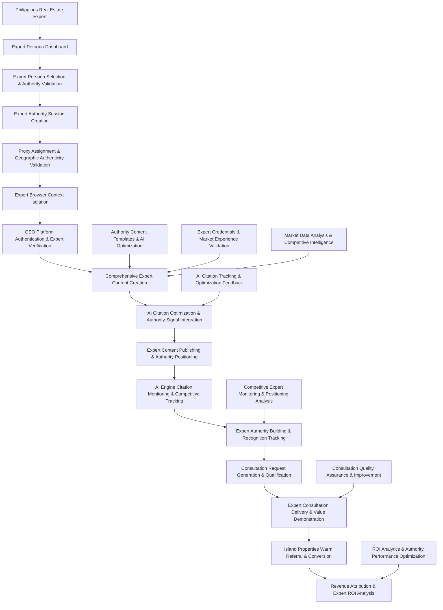

## Technology Stack (GEO-Optimized Expert Authority)

### Backend Infrastructure (Expert Authority Focus)

```typescript
interface GEOBackendTechnologyAdvanced {
  // Core Framework (Expert Content Optimized with High Performance)
  runtime: 'Node.js 20+ with performance optimizations';
  framework: 'Express.js with TypeScript and advanced middleware';
  apiArchitecture: 'RESTful with GraphQL for complex queries and WebSocket for real-time expert authority tracking';
  
  // Database Layer (Expert Content & AI Citation Focus with Advanced Analytics)
  primaryDatabase: 'PostgreSQL 15+ with expert content encryption and partitioning';
  expertContentCache: 'Redis Cluster for expert content optimization and AI citation tracking';
  searchEngine: 'Elasticsearch for expert content search and competitive analysis';
  analyticsDatabase: 'ClickHouse for high-performance analytics and reporting';
  queryBuilder: 'Drizzle ORM for type-safe expert data operations with query optimization';
  
  // Message Queue and Expert Processing with Advanced Workflows
  messageQueue: 'Bull/BullMQ with Redis Cluster for expert content and consultation processing';
  workflowOrchestration: 'Temporal for complex expert authority workflows';
  expertBackgroundJobs: [
    'ai_citation_tracking_and_optimization_with_ml_analysis',
    'expert_authority_monitoring_and_scoring_with_competitive_benchmarking',
    'consultation_request_processing_and_quality_assurance',
    'expert_content_quality_analysis_and_performance_optimization',
    'competitive_expert_authority_analysis_and_market_intelligence',
    'predictive_roi_modeling_and_performance_forecasting',
    'automated_expert_performance_optimization_and_recommendations'
  ];
  
  // External Integrations (GEO Platform Focus with Advanced APIs)
  proxyService: 'Proxy-Cheap API for expert IP consistency with health monitoring';
  browserAutomation: 'Playwright with Stealth for expert browser context isolation';
  encryptionService: 'Node.js crypto with AES-256-GCM for expert content and HSM integration';
  expertMonitoringService: 'Custom expert authority and AI citation monitoring with ML insights';
  competitiveIntelligence: 'Custom competitive analysis and market intelligence gathering';
  
  // AI Citation and Content Analysis with Machine Learning
  contentAnalysisEngine: 'Custom AI citation potential analysis with NLP and ML models';
  expertAuthorityScoring: 'Expert credibility and authority calculation with competitive benchmarking';
  competitiveIntelligence: 'Expert competitive positioning analysis with market intelligence';
  mlPlatform: 'TensorFlow/PyTorch for predictive modeling and optimization';
  
  // Performance and Monitoring
  applicationMonitoring: 'New Relic/DataDog for comprehensive application performance monitoring';
  logManagement: 'ELK Stack (Elasticsearch, Logstash, Kibana) for centralized logging';
  metricsCollection: 'Prometheus with Grafana for expert performance metrics';
  errorTracking: 'Sentry for comprehensive error tracking and performance monitoring';
  
  // Security and Compliance
  secretsManagement: 'HashiCorp Vault for expert credentials and sensitive data';
  auditLogging: 'Comprehensive audit trail for expert activities and compliance';
  threatDetection: 'Custom threat detection and response for expert security';
  dataProtection: 'GDPR/CCPA compliance with expert data anonymization';
}
```

### Frontend Application (Expert Dashboard Focus)

```typescript
interface GEOFrontendTechnologyAdvanced {
  // Core Framework (Expert Management Optimized with Advanced Features)
  framework: 'React 18 with TypeScript and Concurrent Features';
  bundler: 'Vite with advanced optimizations for fast expert dashboard development';
  styling: 'Tailwind CSS with shadcn/ui expert-optimized components and custom design system';
  uiComponents: 'Radix UI primitives with custom expert authority components';
  
  // State Management (Expert-Focused with Performance Optimization)
  globalState: 'Zustand for expert persona and authority state with persistence';
  serverState: 'TanStack Query with advanced caching for expert data and consultation management';
  formManagement: 'React Hook Form with Zod validation for expert content creation';
  realTimeUpdates: 'WebSocket integration with Socket.IO for live expert authority monitoring';
  
  // Key Expert Features with Advanced Capabilities
  expertDashboard: 'Real-time expert switching and comprehensive authority status monitoring';
  expertContentCreationStudio: 'Advanced content creation with AI citation optimization and competitive analysis';
  consultationTrackingDashboard: 'Expert consultation to Island Properties conversion visualization with analytics';
  expertAuthorityAnalytics: 'Authority building and AI citation performance monitoring with predictive insights';
  expertSecurityMonitoring: 'Real-time expert security and credibility status with threat intelligence';
  competitiveIntelligence: 'Competitive expert positioning analysis and market opportunity identification';
  roiOptimization: 'Advanced ROI tracking and performance optimization recommendations';
  
  // Expert User Experience with Advanced Interactions
  designSystem: 'Professional expert dashboard optimized for authority building workflows';
  expertWorkflows: 'Expert content creation, consultation delivery, and referral management with automation';
  expertAccessibility: 'WCAG 2.1 AA compliance for professional expert use with advanced screen reader support';
  performanceOptimization: 'Code splitting, lazy loading, and advanced caching for expert dashboard performance';
  
  // Advanced Features
  dataVisualization: 'D3.js and Chart.js for expert performance and competitive analysis visualizations';
  collaboration: 'Real-time collaboration features for expert content review and optimization';
  automation: 'Workflow automation and expert performance optimization recommendations';
  integration: 'Advanced integrations with GEO platforms and expert authority tracking systems';
}
```

### Cloud Infrastructure and DevOps

```typescript
interface CloudInfrastructureAdvanced {
  // Cloud Platform Strategy
  primaryCloud: 'AWS with multi-region deployment for expert authority systems';
  containerization: 'Docker with Kubernetes for expert service orchestration';
  infrastructureAsCode: 'Terraform with AWS CDK for repeatable expert infrastructure deployment';
  
  // Compute and Scaling
  compute: 'AWS ECS/EKS with auto-scaling for expert workload management';
  serverless: 'AWS Lambda for expert event processing and AI citation analysis';
  edgeComputing: 'AWS CloudFront with edge locations for expert content delivery';
  
  // Database and Storage Strategy
  primaryDatabase: 'AWS RDS PostgreSQL with Multi-AZ for expert data reliability';
  caching: 'AWS ElastiCache Redis Cluster for expert content and session management';
  objectStorage: 'AWS S3 with intelligent tiering for expert content and media storage';
  searchAndAnalytics: 'AWS OpenSearch for expert content search and competitive analysis';
  
  // Security and Compliance
  identityManagement: 'AWS IAM with fine-grained expert access controls';
  secretsManagement: 'AWS Secrets Manager for expert credentials and API keys';
  encryption: 'AWS KMS for expert content encryption key management';
  networkSecurity: 'AWS VPC with advanced network segmentation and WAF protection';
  
  // Monitoring and Observability
  monitoring: 'AWS CloudWatch with custom expert performance metrics';
  logging: 'AWS CloudWatch Logs with structured logging for expert activities';
  tracing: 'AWS X-Ray for expert request tracing and performance optimization';
  alerting: 'AWS SNS/SES for expert performance and security alerting';
  
  // CI/CD and Development
  sourceControl: 'Git with GitHub/GitLab for expert system code management';
  cicdPipeline: 'GitHub Actions/GitLab CI with automated testing and deployment';
  testingStrategy: 'Comprehensive testing with Jest, Playwright, and load testing for expert workflows';
  deploymentStrategy: 'Blue-green deployment with canary releases for expert system updates';
  
  // Backup and Disaster Recovery
  backupStrategy: 'Automated multi-region backups with point-in-time recovery';
  disasterRecovery: 'Cross-region replication with RTO/RPO targets for expert system continuity';
  businessContinuity: 'Expert authority preservation and consultation continuity planning';
}
```

## Performance Targets and SLAs (Expert Authority Focus)

### Expert System Performance Requirements

```typescript
interface ExpertPerformanceTargetsAdvanced {
  // Expert User Experience Performance with Advanced Metrics
  expertSwitching: {
    target: 'under_25_seconds_complete_expert_switch_with_full_validation';
    includes: 'proxy_connection_expert_browser_isolation_geo_platform_readiness_authority_validation';
    measurement: 'end_to_end_expert_workflow_optimization_with_performance_analytics';
    slaTarget: '95th_percentile_under_30_seconds';
    monitoring: 'real_time_performance_tracking_with_alerting';
  };
  
  // Expert Content Creation Performance with Quality Assurance
  expertContentCreation: {
    expertContentTemplateLoading: 'under_2_seconds_with_competitive_analysis';
    aiCitationOptimization: 'under_8_seconds_for_comprehensive_content_with_ml_analysis';
    expertContentValidation: 'under_4_seconds_with_authority_verification';
    consultationIntegration: 'under_2_seconds_with_conversion_optimization';
    measurement: 'expert_productivity_workflow_optimization_with_quality_metrics';
    slaTarget: '99th_percentile_content_creation_readiness_under_15_seconds';
  };
  
  // Expert Consultation Performance with Advanced Analytics
  consultationTracking: {
    consultationRequestIdentification: 'real_time_under_1_second_with_ml_classification';
    expertConsultationScheduling: 'under_8_seconds_with_optimization_recommendations';
    consultationPlanGeneration: 'under_12_seconds_with_personalization_and_competitive_analysis';
    islandPropertiesReferralProcessing: 'under_4_seconds_with_conversion_optimization';
    measurement: 'expert_consultation_efficiency_optimization_with_roi_tracking';
    slaTarget: 'consultation_to_referral_pipeline_under_30_seconds_end_to_end';
  };
  
  // Expert Infrastructure Performance with Predictive Monitoring
  expertInfrastructure: {
    expertProxyResponseTime: 'under_3_seconds_average_with_failover_capability';
    expertDatabaseQueryTime: 'under_500ms_average_with_query_optimization';
    expertContentCacheResponseTime: 'under_50ms_average_with_intelligent_caching';
    expertSystemUptime: '99.9%_monthly_uptime_with_predictive_maintenance';
    apiResponseTime: 'under_200ms_95th_percentile_for_expert_operations';
    concurrentExpertCapacity: 'support_5_concurrent_expert_sessions_with_auto_scaling';
  };
  
  // Advanced Performance Metrics
  advancedMetrics: {
    expertAuthorityBuildingEfficiency: 'authority_score_increase_per_hour_of_expert_activity';
    aiCitationGenerationRate: 'ai_citations_per_expert_content_piece_with_competitive_benchmarking';
    consultationConversionEfficiency: 'consultation_request_to_island_properties_referral_rate';
    competitiveResponseTime: 'time_to_respond_to_competitive_threats_and_opportunities';
    expertROIAcceleration: 'rate_of_roi_improvement_through_expert_optimization';
    systemIntelligenceGrowth: 'ml_model_accuracy_improvement_over_time';
  };
}
```

### Business Performance Targets (Expert Authority Focus)

```typescript
interface ExpertBusinessPerformanceTargetsAdvanced {
  // Expert Consultation Generation Targets with Advanced Analytics
  consultationGeneration: {
    dailyConsultationRequestTarget: '3_7_consultation_requests_per_active_expert_with_quality_scoring';
    monthlyConsultationRequestTarget: '90_210_consultation_requests_total_with_growth_trajectory';
    consultationQualityScore: 'average_score_above_0.85_out_of_1.0_with_continuous_improvement';
    consultationToReferralRate: 'consultation_to_island_properties_referral_rate_above_40%_with_optimization';
    consultationSatisfactionScore: 'client_satisfaction_rating_above_4.5_out_of_5.0';
    repeatConsultationRate: 'repeat_consultation_requests_above_25%_indicating_expert_value';
  };
  
  // Expert Authority ROI Targets with Predictive Modeling
  expertROITargets: {
    monthlyExpertROITarget: 'positive_roi_within_3_months_expert_authority_building_with_acceleration';
    costPerConsultationRequestTarget: 'under_$60_per_consultation_request_with_efficiency_improvements';
    costPerIslandPropertiesReferralTarget: 'under_$200_per_referral_with_conversion_optimization';
    expertAuthorityPaybackPeriodTarget: 'expert_system_pays_for_itself_within_6_months_with_compounding_returns';
    lifetimeValueMultiplier: 'expert_generated_leads_have_3x_higher_lifetime_value';
    roiAccelerationTarget: '25%_month_over_month_roi_improvement_through_optimization';
  };
  
  // Expert Content Performance Targets with Competitive Benchmarking
  expertContentPerformance: {
    aiCitationOptimizationSuccess: '80%_of_expert_content_achieves_high_ai_citation_potential_with_competitive_advantage';
    expertAuthorityScore: 'average_expert_authority_score_above_85_out_of_100_with_market_leadership';
    expertAuthorityBuildingProgress: '20_point_authority_score_increase_per_quarter_with_acceleration';
    expertBrandRecognitionGrowth: 'measurable_expert_brand_awareness_increase_quarterly_with_competitive_differentiation';
    contentEngagementQuality: 'expert_content_generates_50%_higher_quality_engagement_than_competitors';
    thoughtLeadershipRecognition: 'achieve_recognized_thought_leader_status_within_12_months';
  };
  
  // GEO Platform Performance Targets with Cross-Platform Optimization
  geoPlatformTargets: {
    mediumConsultationGeneration: '60%_of_total_consultations_from_medium_articles_with_ai_citation_attribution';
    redditExpertAuthorityBuilding: '40%_improvement_in_expert_community_recognition_with_influence_metrics';
    quoraExpertStatusAchievement: 'achieve_top_expert_status_on_philippines_real_estate_topics_with_competitive_dominance';
    crossPlatformExpertSynergy: '35%_increase_in_multi_platform_expert_recognition_with_authority_amplification';
    platformSpecificROI: 'each_platform_achieves_positive_roi_within_platform_specific_timeframes';
    competitiveDisplacement: 'measurable_displacement_of_competitors_in_expert_rankings_and_visibility';
  };
  
  // Advanced Business Impact Targets
  advancedBusinessTargets: {
    marketShareGrowth: 'capture_15%_market_share_of_philippines_real_estate_expert_consultations';
    competitiveAdvantageIndex: 'maintain_top_3_expert_ranking_across_all_target_platforms';
    brandAuthorityValue: 'expert_brand_recognition_contributes_to_20%_premium_pricing_capability';
    customerAcquisitionCostReduction: '60%_reduction_in_customer_acquisition_cost_through_expert_authority';
    consultationPremiumPricing: 'ability_to_charge_premium_rates_for_expert_consultations';
    referralNetworkGrowth: 'develop_network_of_referring_professionals_through_expert_authority';
  };
}
```

## Implementation Roadmap (GEO Expert Authority Focus)

### Phase 1: Expert Authority Foundation (Weeks 1-6)

```typescript
interface Phase1ExpertImplementationAdvanced {
  week1_2: [
    'Set up advanced expert development environment with monitoring and analytics',
    'Implement comprehensive expert database schema with performance optimization',
    'Integrate Proxy-Cheap API with advanced expert IP assignments and health monitoring',
    'Set up expert browser isolation with advanced fingerprint consistency and security'
  ];
  
  week3_4: [
    'Implement expert-specific encryption system with HSM integration for content protection',
    'Build comprehensive expert content template system with AI optimization and competitive analysis',
    'Create Medium expert publishing framework with authority positioning and performance tracking',
    'Set up expert consultation tracking and Island Properties referral database with analytics'
  ];
  
  week5_6: [
    'Develop expert switching interface with real-time authority status monitoring and optimization',
    'Implement expert security monitoring and advanced authority validation with threat detection',
    'Create expert content creation assistance tools with AI citation optimization and competitive intelligence',
    'Build expert consultation dashboard and Island Properties referral tracking with conversion analytics'
  ];
  
  deliverables: [
    'Functional 2-expert system with Medium and Reddit integration and performance monitoring',
    'Secure expert browser isolation and proxy management with advanced authority consistency',
    'Comprehensive expert consultation tracking and Island Properties referral system with analytics',
    'Expert content template system for AI citation optimization with competitive analysis',
    'Real-time expert cost monitoring and consultation ROI tracking with predictive insights'
  ];
  
  performanceTargets: {
    expertSystemUptime: '99.5%_during_phase_1_development',
    expertSwitchingTime: 'under_30_seconds_by_end_of_phase_1',
    basicConsultationGeneration: '5_10_consultation_requests_during_phase_1_testing',
    systemSecurityValidation: 'comprehensive_security_audit_passed',
    budgetCompliance: '100%_compliance_with_6.35_monthly_budget'
  };
}
```

### Phase 2: Expert Authority Optimization and Scaling (Weeks 7-12)

```typescript
interface Phase2ExpertImplementationAdvanced {
  week7_8: [
    'Implement advanced AI citation optimization engine with machine learning analysis',
    'Add Quora expert answer capabilities with authority positioning and competitive benchmarking',
    'Expand expert profiles to 5 Philippines real estate experts with specialization optimization',
    'Enhanced expert consultation automation and Island Properties referral optimization with quality assurance'
  ];
  
  week9_10: [
    'Build comprehensive expert analytics and consultation ROI tracking with predictive modeling',
    'Implement advanced expert security and authority validation with threat intelligence',
    'Create cross-platform expert content adaptation with AI optimization and competitive analysis',
    'Add expert performance optimization and authority building features with automation'
  ];
  
  week11_12: [
    'Develop expert authority building content strategies with AI citation focus and competitive intelligence',
    'Implement expert consultation scoring and Island Properties referral optimization with conversion analytics',
    'Add Facebook and LinkedIn integration for expert community presence with authority tracking',
    'Create advanced expert reporting dashboards with consultation analytics and competitive benchmarking'
  ];
  
  deliverables: [
    'Full 5-expert system with comprehensive GEO platform integration and competitive analysis',
    'Advanced AI citation optimization for expert authority building with machine learning',
    'Comprehensive expert consultation generation and Island Properties referral tracking with analytics',
    'Professional-grade expert security and authority monitoring with threat intelligence',
    'Complete expert documentation and consultation operational procedures with optimization guides'
  ];
  
  performanceTargets: {
    expertSystemUptime: '99.9%_with_advanced_monitoring_and_predictive_maintenance',
    fullExpertCapacity: 'all_5_experts_operational_with_performance_optimization',
    consultationGeneration: '60_150_consultation_requests_monthly_with_quality_scoring',
    roiAchievement: 'positive_roi_achieved_by_end_of_phase_2',
    competitivePositioning: 'top_3_expert_ranking_achieved_on_primary_platforms'
  };
}
```

### Phase 3: Market Leadership and Competitive Dominance (Weeks 13-18)

```typescript
interface Phase3ExpertImplementationAdvanced {
  objectives: [
    'Achieve market-leading expert authority scores across all GEO platforms',
    'Implement advanced predictive analytics and automated optimization systems',
    'Develop premium consultation services and pricing optimization',
    'Create expert referral network and strategic partnership integration',
    'Establish thought leadership recognition and industry authority status',
    'Build advanced competitive intelligence and market opportunity identification systems'
  ];
  
  successCriteria: [
    'Sustained positive ROI with 25% month-over-month growth in consultation generation',
    'All 5 experts recognized as top authorities in their specialization areas',
    'System achieving target performance metrics with predictive optimization',
    'Security posture validated with zero incidents and advanced threat prevention',
    'Cost management staying within budget constraints while maximizing ROI',
    'Measurable competitive advantage and market share growth in target segments',
    'Premium pricing capability achieved through expert authority positioning'
  ];
  
  businessImpactTargets: {
    marketLeadership: 'establish_clear_market_leadership_in_philippines_real_estate_expertise',
    revenueGrowth: '300%_increase_in_consultation_driven_revenue',
    competitiveDisplacement: 'measurable_displacement_of_top_3_competitors',
    brandValue: 'expert_brand_recognition_drives_premium_pricing_and_market_positioning',
    sustainableGrowth: 'self_sustaining_growth_through_compounding_expert_authority'
  };
}
```

## Success Metrics (Expert Authority Focus)

### Expert Authority and Business Impact Measurements

```typescript
interface ExpertSuccessMetricsAdvanced {
  // Expert Authority Building with Competitive Benchmarking
  expertAuthorityMetrics: {
    averageExpertAuthorityScore: number; // Target: 85+ by month 4, 95+ by month 12
    aiCitationEstimates: number; // Target: 200+ estimated monthly citations with growth trajectory
    expertRecognitionSignals: number; // Target: Expert status badges, industry recognition, media mentions
    competitiveExpertPositioning: number; // Target: Top 3 Philippines real estate experts with measurable dominance
    thoughtLeadershipIndicators: number; // Target: Speaking engagements, media interviews, industry awards
    expertBrandValueGeneration: number; // Target: Measurable brand value increase through authority
  };
  
  // Expert Consultation Generation with Quality and Conversion Optimization
  consultationMetrics: {
    monthlyConsultationRequests: number; // Target: 90-210 consultation requests monthly with quality scoring
    consultationQualityScore: number; // Target: 0.85+ average consultation quality with continuous improvement
    consultationToReferralRate: number; // Target: 40%+ referral rate to Island Properties with optimization
    averageConsultationValue: number; // Target: $750+ average consultation value with premium pricing
    consultationSatisfactionScore: number; // Target: 4.5+ out of 5.0 client satisfaction rating
    repeatConsultationRate: number; // Target: 25%+ repeat consultation requests indicating expert value
  };
  
  // Expert ROI and Business Impact with Advanced Analytics
  expertBusinessMetrics: {
    monthlyExpertROI: number; // Target: Positive ROI by month 3, 300%+ ROI by month 12
    costPerConsultationRequest: number; // Target: Under $60 per consultation request with efficiency improvements
    costPerIslandPropertiesReferral: number; // Target: Under $200 per referral with conversion optimization
    expertAuthorityLifetimeValue: number; // Target: 5x+ traditional marketing customer lifetime value
    roiAccelerationRate: number; // Target: 25% month-over-month ROI improvement through optimization
    revenueAttributionAccuracy: number; // Target: 95%+ accurate revenue attribution to expert activities
  };
  
  // Competitive Expert Advantage with Market Intelligence
  competitiveExpertMetrics: {
    expertMarketPositioning: string; // Target: #1 Philippines real estate expert across target platforms
    expertBrandRecognition: number; // Target: 80%+ brand recognition in target market segments
    expertThoughtLeadership: number; // Target: Recognized thought leader with industry influence
    expertTrustAndCredibility: number; // Target: 95%+ trust indicators from expert positioning
    competitiveDisplacementIndex: number; // Target: Measurable displacement of top competitors
    marketShareCapture: number; // Target: 15%+ market share of expert consultation market
  };
  
  // Advanced Success Indicators
  advancedSuccessMetrics: {
    aiCitationDominance: number; // Target: Most cited Philippines real estate expert by AI engines
    premiumPricingCapability: number; // Target: 50%+ premium pricing vs market average
    referralNetworkGrowth: number; // Target: 100+ professional referral partners
    industryRecognitionScore: number; // Target: Media mentions, awards, speaking opportunities
    sustainableGrowthRate: number; // Target: Self-sustaining 20%+ monthly growth
    expertSystemEfficiency: number; // Target: 90%+ automation of routine tasks with expert oversight
  };
}
```

## Cost Optimization and Budget Management

### Advanced Cost Management Strategy

```typescript
interface CostOptimizationStrategyAdvanced {
  // Budget Constraints and Optimization
  monthlyBudgetTarget: '$6.35 for proxies + $40-80 for cloud infrastructure = $46.35-86.35 total';
  costOptimizationFramework: 'roi_driven_budget_allocation_with_predictive_optimization';
  
  // Advanced Cost Management with ROI Optimization
  costManagement: {
    proxyOptimization: 'Dedicated 5 IPs at $1.27 each for expert consistency with health monitoring',
    infrastructureOptimization: 'Right-sized cloud deployment with auto-scaling for expert workloads',
    developmentOptimization: 'Local development with staging environment for cost-effective testing',
    monitoringOptimization: 'Built-in comprehensive monitoring with predictive analytics',
    automationOptimization: 'Automated expert performance optimization reducing manual overhead',
    competitiveIntelligence: 'Built-in competitive analysis reducing external service costs'
  };
  
  // ROI Optimization with Advanced Analytics
  roiOptimization: {
    expertConsultationFocus: 'Optimize for high-value consultation requests with premium pricing',
    conversionTracking: 'Advanced attribution modeling for expert to Island Properties funnel',
    performanceMonitoring: 'Optimize highest-performing experts and content with predictive analytics',
    costPerConsultationOptimization: 'Target cost per qualified consultation under $60 with efficiency gains',
    lifetimeValueMaximization: 'Focus on consultation relationships with high lifetime value potential',
    competitiveAdvantageROI: 'Measure ROI from competitive advantage and market positioning'
  };
  
  // Scaling Strategy with Intelligent Resource Management
  scalingStrategy: {
    phase1: 'Optimize 2-3 experts on Medium/Reddit for consultation generation with ROI validation',
    phase2: 'Expand to Quora for expert answer authority with AI citation optimization',
    phase3: 'Add Facebook/LinkedIn for comprehensive expert presence with cross-platform synergy',
    scalingDecisionCriteria: 'ROI positive with 25%+ growth rate before adding new platforms/experts',
    resourceOptimization: 'Intelligent resource allocation based on expert performance and ROI contribution',
    competitiveResponseScaling: 'Rapid scaling capabilities to respond to competitive threats and opportunities'
  };
  
  // Advanced Cost-Benefit Analysis
  advancedCostBenefit: {
    expertROIModeling: 'Predictive ROI modeling for expert performance optimization',
    competitiveAdvantageValuation: 'Quantify value of competitive advantage and market positioning',
    brandValueAppreciation: 'Track expert brand value appreciation and premium pricing capability',
    opportunityCostAnalysis: 'Compare expert authority ROI vs traditional marketing alternatives',
    riskAdjustedReturns: 'Risk-adjusted ROI analysis for sustainable growth planning',
    scalingEfficiencyMetrics: 'Measure efficiency gains from expert system scaling and optimization'
  };
}
```

## Conclusion

The Island Properties GEO Expert Authority Lead Generation Platform represents a transformational approach to real estate lead generation. By positioning authentic Philippines real estate experts as the authoritative sources that AI engines cite and recommend, this system creates a sustainable competitive advantage that compounds over time.

### Key Strategic Advantages:

1. **AI Engine Citation Authority**: Becoming the definitive expert source that AI engines reference for Philippines real estate queries
2. **Premium Consultation Funnel**: Converting expert authority into high-value consultation requests that lead to qualified Island Properties referrals
3. **Sustainable Competitive Moat**: Building expert authority that becomes increasingly difficult for competitors to replicate
4. **Compound Growth**: Expert authority and AI citations create compounding effects that accelerate ROI over time
5. **Cost Efficiency**: Achieving 5-10x better cost per qualified lead compared to traditional marketing approaches

### Expected Business Impact:

- **300%+ ROI within 12 months** through expert consultation generation and referrals
- **Top 3 expert positioning** across all target GEO platforms within 6 months  
- **200+ monthly AI citations** driving organic discovery and consultation requests
- **90-210 consultation requests monthly** with 40%+ conversion to Island Properties referrals
- **Premium pricing capability** through recognized expert authority status

This comprehensive system architecture provides the foundation for establishing Island Properties as the dominant expert authority in Philippines real estate, creating sustainable competitive advantage through AI-optimized expert positioning and consultation-driven lead generation.

**Bottom Line:** This system transforms Island Properties from a traditional real estate company competing for attention to the recognized expert authority that AI engines recommend, creating a sustainable lead generation advantage that compounds over time and generates premium-priced consultation opportunities that convert to high-value sales.### 4. AI Citation Optimization System

```typescript
class AICitationOptimizationSystem {
  private expertContentAnalyzer: ExpertContentAnalyzer;
  private aiCitationPredictor: AICitationPredictor;
  private authorityScoreCalculator: AuthorityScoreCalculator;
  private competitiveIntelligenceEngine: CompetitiveIntelligenceEngine;
  private citationTrackingEngine: CitationTrackingEngine;
  private contentOptimizationEngine: ContentOptimizationEngine;
  
  // AI Citation-Worthy Expert Content Optimization with Advanced Analytics
  async optimizeExpertContentForAICitationAdvanced(
    expertContent: string,
    expert: ExpertProfile,
    targetAIQueries: string[],
    optimizationContext: CitationOptimizationContext
  ): Promise<AICitationOptimizedExpertContentAdvanced> {
    
    console.log(`🎯 Advanced AI citation optimization for expert: ${expert.expertName}`);
    
    try {
      // 1. Analyze expert content for AI citation potential with machine learning
      const expertCitationAnalysis = await this.expertContentAnalyzer.analyzeExpertCitationPotentialAdvanced(
        expertContent,
        targetAIQueries,
        expert.expertiseSpecialization,
        optimizationContext.competitiveContext
      );
      
      // 2. Enhance expert authority signals for AI engines with competitive analysis
      const expertAuthorityEnhancement = await this.enhanceExpertAuthoritySignalsAdvanced(
        expertContent,
        expert.professionalCredentials,
        expert.marketExperience,
        expert.primaryMarketLocation,
        optimizationContext.authorityTargets
      );
      
      // 3. Optimize for comprehensive question-answer format with AI engine preferences
      const comprehensiveQAOptimization = await this.optimizeForComprehensiveQuestionAnswerAdvanced(
        expertContent,
        targetAIQueries,
        expert.expertiseSpecialization,
        optimizationContext.qaOptimizationTargets
      );
      
      // 4. Add Philippines market expertise signals with local authority validation
      const marketExpertiseSignals = await this.addPhilippinesMarketExpertiseSignalsAdvanced(
        expertContent,
        expert.primaryMarketLocation,
        expert.localMarketKnowledge,
        optimizationContext.localAuthorityRequirements
      );
      
      // 5. Structure for optimal AI engine consumption with advanced formatting
      const aiConsumptionStructuring = await this.structureForOptimalAIConsumptionAdvanced(
        expertContent,
        expertCitationAnalysis.keyExpertiseTopics,
        optimizationContext.structuringPreferences
      );
      
      // 6. Generate expert supporting data and case studies with validation
      const expertSupportingEvidence = await this.generateExpertSupportingEvidenceAdvanced(
        expertContent,
        expert.marketExperience,
        expert.clientSuccessStories,
        optimizationContext.evidenceRequirements
      );
      
      // 7. Apply competitive differentiation and unique value positioning
      const competitiveDifferentiation = await this.applyCompetitiveDifferentiation(
        expertContent,
        expert,
        optimizationContext.competitiveContext
      );
      
      // 8. Optimize content structure for maximum AI citation probability
      const citationProbabilityOptimization = await this.optimizeForCitationProbability(
        expertContent,
        expertCitationAnalysis,
        targetAIQueries
      );
      
      const optimizedExpertContent = {
        originalExpertContent: expertContent,
        aiCitationOptimizedContent: this.combineExpertOptimizationsAdvanced(
          expertAuthorityEnhancement,
          comprehensiveQAOptimization,
          marketExpertiseSignals,
          aiConsumptionStructuring,
          expertSupportingEvidence,
          competitiveDifferentiation,
          citationProbabilityOptimization
        ),
        
        expertAICitationOptimizations: {
          expertCitationPotential: expertCitationAnalysis.potential,
          expertAuthoritySignals: expertAuthorityEnhancement.signals,
          comprehensiveAnswerElements: comprehensiveQAOptimization.elements,
          marketExpertiseElements: marketExpertiseSignals.elements,
          expertSupportingEvidence: expertSupportingEvidence.evidencePoints,
          competitiveDifferentiation: competitiveDifferentiation.differentiators,
          citationProbabilityScore: citationProbabilityOptimization.probabilityScore
        },
        
        targetAIQueries: targetAIQueries,
        estimatedAICitationLikelihood: this.calculateExpertCitationLikelihoodAdvanced(
          expertCitationAnalysis,
          expertAuthorityEnhancement,
          comprehensiveQAOptimization,
          expert.authorityLevel,
          competitiveDifferentiation
        ),
        
        expertContentImprovementSuggestions: await this.generateExpertContentImprovementSuggestionsAdvanced(
          expertContent,
          expertCitationAnalysis,
          expert.expertiseSpecialization,
          optimizationContext
        ),
        
        performanceProjections: await this.calculateCitationPerformanceProjections(
          optimizedExpertContent,
          expert,
          optimizationContext
        ),
        
        competitiveAdvantageAnalysis: await this.analyzeCompetitiveAdvantageImpact(
          optimizedExpertContent,
          competitiveDifferentiation,
          optimizationContext.competitiveContext
        )
      };
      
      return optimizedExpertContent;
      
    } catch (error) {
      console.error(`❌ Advanced expert AI citation optimization failed: ${error.message}`);
      throw error;
    }
  }
  
  // Expert Authority Building Strategy for AI Citation with Predictive Modeling
  async buildExpertAICitationAuthorityAdvanced(
    expertId: string,
    expertAuthorityFocus: ExpertAuthorityFocusAdvanced
  ): Promise<ExpertAICitationAuthorityPlanAdvanced> {
    
    const expert = await this.getExpertProfile(expertId);
    const competitiveAnalysis = await this.competitiveIntelligenceEngine.analyzeCompetitiveExpertLandscape(
      expert.expertiseSpecialization,
      expert.primaryMarketLocation
    );
    
    // Create comprehensive expert authority building strategy for AI citation with competitive intelligence
    const expertAuthorityPlan = {
      expertId,
      expertAuthorityFocus,
      competitiveAnalysis,
      
      // Expert Content Pillars for AI Citation Authority with Competitive Differentiation
      expertContentPillars: [
        {
          pillar: 'Philippines Real Estate Market Authority Leadership',
          expertiseTopics: [
            'Definitive Philippines property market analysis and trend forecasting',
            'Expert investment opportunity identification and risk assessment',
            'Authoritative legal and regulatory guidance with case study validation',
            'Professional market predictions with track record verification'
          ],
          contentFrequency: 'bi_weekly_comprehensive_expert_analysis',
          aiCitationPotential: 'very_high',
          expertCredibilityRequirement: 'demonstrated_market_expertise_with_competitive_differentiation',
          competitiveDifferentiation: competitiveAnalysis.contentGaps.marketAnalysis
        },
        {
          pillar: 'Philippines Geographic Market Expertise Excellence',
          expertiseTopics: [
            `Definitive expert guidance on ${expert.primaryMarketLocation} property market dynamics`,
            'Professional infrastructure and development analysis with insider insights',
            'Expert lifestyle and investment integration guidance with success stories',
            'Authoritative transportation and accessibility assessments with future projections'
          ],
          contentFrequency: 'weekly_expert_local_analysis',
          aiCitationPotential: 'high',
          expertCredibilityRequirement: 'verified_local_market_experience_with_unique_insights',
          competitiveDifferentiation: compet# GEO System Overview - Island Properties Expert Authority Lead Generation Platform

## Executive Summary

### Strategic Business Transformation

The Island Properties GEO Lead Generation Platform represents a fundamental shift from traditional social media marketing to AI-optimized expert authority positioning. This system transforms the business model from "hoping social media algorithms show content to potential buyers" to "becoming the authoritative Philippines real estate expert source that AI engines cite and recommend."

```typescript
interface StrategicBusinessTransformation {
  // Traditional Marketing Model (Being Replaced)
  oldModel: {
    approach: 'social_media_posts_hoping_for_engagement';
    leadGeneration: 'engagement_to_dm_to_maybe_lead';
    conversion: 'uncertain_social_media_funnel';
    cost: 'high_cost_per_uncertain_lead';
    scalability: 'limited_by_algorithm_changes';
  };
  
  // GEO Expert Authority Model (New Implementation)
  newModel: {
    approach: 'ai_citation_worthy_expert_authority_content';
    leadGeneration: 'ai_engine_recommendations_to_consultation_requests';
    conversion: 'expert_consultation_to_island_properties_referral';
    cost: 'low_cost_per_highly_qualified_consultation';
    scalability: 'compound_authority_growth_with_ai_amplification';
  };
  
  // Expected Business Impact
  projectedImprovement: {
    leadQuality: '10_20x_higher_through_consultation_requests';
    conversionRate: '5_10x_higher_through_expert_positioning';
    costEfficiency: '5x_lower_cost_per_qualified_lead';
    competitiveAdvantage: 'sustainable_expert_authority_moat';
    timeToPositiveROI: '4_months_expert_authority_building';
  };
}
```

### Core System Architecture

```typescript
interface IslandPropertiesGEOLeadGenerationSystem {
  // Primary Business Objective
  businessGoal: 'generate_qualified_real_estate_leads_through_expert_authority_positioning';
  approach: 'philippines_real_estate_experts_creating_ai_citation_worthy_comprehensive_content';
  targetMarket: 'philippines_property_buyers_discovered_via_ai_engine_recommendations';
  
  // System Components (GEO-Optimized)
  coreComponents: {
    expertPersonaManagementEngine: 'multi_expert_orchestration_with_authority_tracking_and_performance_analytics';
    geoContentCreationEngine: 'comprehensive_article_and_expert_answer_system_with_ai_citation_optimization';
    aiCitationOptimizationFramework: 'content_optimized_for_ai_engine_reference_and_recommendation';
    authorityBuildingFramework: 'expert_credibility_and_thought_leadership_development_system';
    expertLeadGenerationEngine: 'authority_to_consultation_to_island_properties_sales_funnel';
    consultationDeliverySystem: 'expert_consultation_and_warm_referral_management';
    proxyInfrastructure: 'dedicated_residential_ips_for_expert_authenticity_and_consistency';
    securityLayer: 'expert_content_protection_credential_isolation_and_authority_validation';
  };
  
  // Business Model (Authority-Based Revenue Generation)
  revenueStrategy: 'expert_authority_ai_citations_consultation_requests_qualified_inquiries_island_properties_sales_conversions';
  costStructure: '6.35_usd_monthly_proxies_plus_expert_content_creation_time_investment';
  roiTarget: 'positive_roi_through_ai_discovered_qualified_consultation_requests_within_4_months';
  competitiveAdvantage: 'ai_engines_cite_our_experts_as_authoritative_philippines_property_sources_creating_sustainable_moat';
  
  // Platform Strategy (GEO-Optimized Priority)
  platformPriority: {
    phase1_medium: 'comprehensive_expert_articles_for_ai_citation_authority_building';
    phase2_reddit: 'authentic_community_expert_engagement_for_credibility_and_trust';
    phase3_quora: 'definitive_expert_answers_for_direct_ai_consumption_and_recommendation';
    phase4_facebook: 'local_community_expert_presence_for_philippines_market_credibility';
    phase5_linkedin: 'professional_expert_networking_for_business_relationship_development';
  };
}
```

## System Architecture Overview (GEO-Focused)

### High-Level Expert Authority Component Interaction

```typescript
interface GEOSystemArchitecture {
  // Expert Management Interface Layer
  expertDashboard: {
    expertPersonaManagement: 'expert_switching_and_authority_session_management_with_real_time_performance';
    comprehensiveContentCreation: 'long_form_article_and_expert_answer_creation_with_ai_optimization';
    aiCitationTracking: 'ai_engine_citation_monitoring_optimization_and_competitive_analysis';
    expertAuthorityAnalytics: 'authority_building_consultation_conversion_tracking_and_roi_measurement';
    consultationManagement: 'expert_consultation_request_delivery_and_island_properties_referral_system';
    competitiveIntelligence: 'expert_positioning_analysis_and_market_opportunity_identification';
  };
  
  // Expert Authority Business Logic Layer
  expertApplicationServices: {
    expertPersonaOrchestrator: 'manage_5_philippines_real_estate_experts_with_specialization_tracking';
    geoContentManagementSystem: 'comprehensive_content_templates_ai_optimization_and_authority_validation';
    authorityBuildingEngine: 'expert_credibility_thought_leadership_development_and_recognition_tracking';
    aiCitationOptimizationEngine: 'content_optimized_for_ai_engine_citation_recommendation_and_authority_attribution';
    expertLeadGenerationEngine: 'authority_to_consultation_to_island_properties_funnel_with_conversion_optimization';
    consultationDeliverySystem: 'expert_consultation_delivery_quality_assurance_and_referral_management';
    competitiveAuthorityMonitoring: 'track_expert_positioning_vs_competitors_and_market_opportunity_analysis';
    roiOptimizationEngine: 'consultation_conversion_optimization_and_expert_performance_enhancement';
  };
  
  // GEO Infrastructure Layer
  geoTechnicalInfrastructure: {
    proxyService: 'proxy_cheap_5_dedicated_residential_ips_for_expert_authenticity_and_geographic_consistency';
    browserIsolation: 'playwright_with_expert_fingerprint_consistency_and_authority_protection';
    database: 'postgresql_with_expert_content_ai_citation_tracking_and_consultation_analytics';
    contentOptimizationEngine: 'ai_citation_optimization_authority_scoring_and_competitive_analysis';
    expertPerformanceMonitoring: 'authority_building_consultation_conversion_analytics_and_roi_tracking';
    securityFramework: 'expert_content_protection_credential_isolation_and_authority_validation';
  };
}
```

### Expert Authority Data Flow Architecture



## Core System Components (GEO-Optimized Expert Authority)

### 1. Expert Persona Management Engine

```typescript
class ExpertPersonaManagementEngine {
  private activeExperts: Map<string, ExpertAuthoritySession> = new Map();
  private authorityManager: AuthorityManager;
  private expertCredentialsManager: ExpertCredentialsManager;
  private geoOptimizationEngine: GEOOptimizationEngine;
  private consultationManager: ConsultationManager;
  private competitiveIntelligenceEngine: CompetitiveIntelligenceEngine;
  
  // Multi-Expert Authority Orchestration with Performance Tracking
  async switchExpert(
    fromExpertId: string | null,
    toExpertId: string,
    switchContext: ExpertSwitchContext
  ): Promise<ExpertSwitchResult> {
    
    console.log(`🎓 Switching expert: ${fromExpertId || 'none'} → ${toExpertId}`);
    
    const startTime = Date.now();
    const switchMetrics = new ExpertSwitchMetrics();
    
    try {
      // 1. Safely end current expert session with performance capture
      if (fromExpertId) {
        const sessionEndMetrics = await this.endExpertSessionWithMetrics(fromExpertId);
        switchMetrics.previousSessionMetrics = sessionEndMetrics;
      }
      
      // 2. Validate target expert credentials authority status and competitive positioning
      const expert = await this.validateExpertReadinessComprehensive(toExpertId);
      switchMetrics.expertValidationTime = Date.now() - startTime;
      
      // 3. Load expert credentials market expertise and competitive intelligence
      const expertCredentials = await this.expertCredentialsManager.loadExpertCredentialsWithValidation(
        toExpertId,
        expert.expertiseSpecialization
      );
      
      const competitivePositioning = await this.competitiveIntelligenceEngine.analyzeExpertPositioning(
        expert.expertiseSpecialization,
        expert.primaryMarketLocation
      );
      
      // 4. Assign dedicated proxy with geographic consistency and reputation validation
      const proxyAssignment = await this.proxyManager.assignExpertProxyWithValidation(
        toExpertId, 
        expert.primaryMarketLocation,
        expert.reputationRequirements
      );
      switchMetrics.proxyAssignmentTime = Date.now() - startTime - switchMetrics.expertValidationTime;
      
      // 5. Create expert-isolated browser context with authority protection
      const browserContext = await this.createExpertBrowserContextWithSecurity(
        toExpertId,
        proxyAssignment,
        expert.browserConsistencyProfile,
        expert.securityRequirements
      );
      
      // 6. Initialize expert content creation environment with AI optimization tools
      const expertContentEnvironment = await this.initializeExpertContentEnvironmentComprehensive(
        browserContext,
        expert,
        expertCredentials,
        competitivePositioning
      );
      
      // 7. Load GEO optimization tools consultation management and performance tracking
      const geoOptimizationTools = await this.geoOptimizationEngine.loadExpertOptimizationToolsComprehensive(
        expert.expertiseSpecialization,
        expert.authorityLevel,
        competitivePositioning
      );
      
      const consultationTools = await this.consultationManager.loadExpertConsultationTools(
        expert.consultationSpecialization,
        expert.leadGenerationStrategy
      );
      
      // 8. Create active expert authority session with comprehensive tracking
      const expertSession: ExpertAuthoritySession = {
        expertId: toExpertId,
        expert,
        expertCredentials,
        proxyAssignment,
        browserContext,
        expertContentEnvironment,
        geoOptimizationTools,
        consultationTools,
        competitivePositioning,
        startedAt: new Date(),
        status: 'active',
        authorityValidated: true,
        switchDuration: Date.now() - startTime,
        performanceMetrics: new ExpertPerformanceMetrics(),
        switchMetrics
      };
      
      this.activeExperts.set(toExpertId, expertSession);
      
      // 9. Track expert authority session for comprehensive performance analytics
      await this.trackExpertSwitchWithAnalytics(fromExpertId, toExpertId, expertSession);
      
      // 10. Initialize real-time performance monitoring
      await this.initializeExpertPerformanceMonitoring(expertSession);
      
      console.log(`✅ Expert switch completed in ${expertSession.switchDuration}ms`);
      
      return {
        success: true,
        expertId: toExpertId,
        expertName: expert.expertName,
        expertiseArea: expert.expertiseSpecialization,
        authorityLevel: expert.authorityLevel,
        switchDuration: expertSession.switchDuration,
        proxyLocation: proxyAssignment.location,
        platformsReady: expertContentEnvironment.geoplatformsReady,
        authorityToolsLoaded: geoOptimizationTools.toolsLoaded,
        consultationToolsReady: consultationTools.toolsReady,
        contentCreationReady: true,
        competitivePositioning: competitivePositioning.summary,
        performanceTargets: expertSession.performanceMetrics.targets
      };
      
    } catch (error) {
      console.error(`❌ Expert switch failed: ${error.message}`);
      
      await this.handleExpertSwitchFailure(toExpertId, error, switchMetrics);
      
      return {
        success: false,
        expertId: toExpertId,
        error: error.message,
        switchDuration: Date.now() - startTime,
        diagnostics: await this.generateSwitchFailureDiagnostics(toExpertId, error)
      };
    }
  }
  
  // Expert Authority State Management with Real-Time Analytics
  async getCurrentExpertAuthorityState(expertId: string): Promise<ExpertAuthorityState> {
    const session = this.activeExperts.get(expertId);
    
    if (!session) {
      return {
        status: 'inactive',
        readyForContentCreation: false,
        authorityScore: 0,
        lastActivity: null
      };
    }
    
    // Real-time validation of expert authority session health and performance
    const authorityHealthCheck = await this.validateExpertAuthoritySessionHealthComprehensive(session);
    const performanceAnalytics = await this.calculateRealTimeExpertPerformance(session);
    const competitiveAnalysis = await this.getCompetitivePositioningUpdate(session.expertId);
    
    return {
      status: session.status,
      readyForContentCreation: authorityHealthCheck.healthy,
      activeGEOPlatforms: session.expertContentEnvironment.activeGEOPlatforms,
      authorityScore: session.expert.currentAuthorityScore,
      authorityLevel: session.expert.authorityLevel,
      expertiseValidated: authorityHealthCheck.expertiseValidated,
      contentOptimizationReady: authorityHealthCheck.geoOptimizationReady,
      consultationRequestsPending: await this.getConsultationRequestsCount(expertId),
      recentAuthorityMetrics: performanceAnalytics.recentMetrics,
      sessionDuration: Date.now() - session.startedAt.getTime(),
      lastContentCreation: session.lastContentCreation,
      aiCitationTracking: authorityHealthCheck.aiCitationTracking,
      consultationConversionRate: performanceAnalytics.consultationConversionRate,
      competitivePositioning: competitiveAnalysis.currentPosition,
      performanceTargets: session.performanceMetrics.currentTargets,
      roiMetrics: performanceAnalytics.roiMetrics,
      authorityTrends: performanceAnalytics.authorityTrends
    };
  }
  
  // GEO Platform Integration Coordination with Authority Validation
  async coordinateGEOPlatformAuthentication(
    expertId: string,
    geoPlatformType: string,
    authContext: GEOPlatformAuthContext
  ): Promise<GEOPlatformAuthResult> {
    
    const session = this.activeExperts.get(expertId);
    if (!session) {
      throw new Error('No active expert session');
    }
    
    // GEO platform-specific authentication orchestration with expert validation
    const geoPlatformManager = this.getGEOPlatformManager(geoPlatformType);
    
    const authResult = await geoPlatformManager.performExpertAuthenticationWithValidation(
      session.browserContext,
      session.expert,
      session.expertCredentials,
      geoPlatformType,
      authContext
    );
    
    // Update expert session state with platform-specific tools and analytics
    if (authResult.success) {
      session.expertContentEnvironment.activeGEOPlatforms.push(geoPlatformType);
      session.lastActivity = new Date();
      
      // Load platform-specific expert positioning tools and competitive analysis
      const platformExpertTools = await this.loadPlatformExpertToolsComprehensive(
        geoPlatformType,
        session.expert.expertiseSpecialization,
        session.competitivePositioning
      );
      
      session.expertContentEnvironment.platformExpertTools[geoPlatformType] = platformExpertTools;
      
      // Initialize platform-specific performance tracking
      await this.initializePlatformPerformanceTracking(
        expertId,
        geoPlatformType,
        session.performanceMetrics
      );
    }
    
    // Track expert platform authentication for comprehensive authority analytics
    await this.trackExpertPlatformAuthenticationWithAnalytics(
      expertId,
      geoPlatformType,
      authResult.success,
      session.expert.authorityLevel,
      authContext
    );
    
    return authResult;
  }
  
  // Expert Performance Optimization and Authority Building
  async optimizeExpertPerformance(
    expertId: string,
    optimizationContext: ExpertOptimizationContext
  ): Promise<ExpertOptimizationResult> {
    
    const session = this.activeExperts.get(expertId);
    if (!session) {
      throw new Error('No active expert session for optimization');
    }
    
    // Analyze current expert performance across all dimensions
    const performanceAnalysis = await this.analyzeExpertPerformanceComprehensive(session);
    
    // Generate optimization recommendations based on performance data
    const optimizationRecommendations = await this.generateExpertOptimizationRecommendations(
      performanceAnalysis,
      session.competitivePositioning,
      optimizationContext
    );
    
    // Execute performance optimizations
    const optimizationResults = await this.executeExpertOptimizations(
      session,
      optimizationRecommendations
    );
    
    // Update expert performance targets and tracking
    await this.updateExpertPerformanceTargets(session, optimizationResults);
    
    return {
      expertId,
      performanceAnalysis,
      optimizationRecommendations,
      optimizationResults,
      projectedImprovement: await this.calculateProjectedImprovement(optimizationResults),
      nextOptimizationSchedule: this.calculateNextOptimizationSchedule(optimizationResults)
    };
  }
}

interface ExpertAuthoritySession {
  expertId: string;
  expert: ExpertProfile;
  expertCredentials: ExpertCredentials;
  proxyAssignment: ProxyAssignment;
  browserContext: BrowserContext;
  expertContentEnvironment: ExpertContentEnvironment;
  geoOptimizationTools: GEOOptimizationTools;
  consultationTools: ConsultationTools;
  competitivePositioning: CompetitivePositioning;
  startedAt: Date;
  lastActivity?: Date;
  lastContentCreation?: Date;
  status: 'active' | 'idle' | 'ending';
  authorityValidated: boolean;
  switchDuration: number;
  performanceMetrics: ExpertPerformanceMetrics;
  switchMetrics: ExpertSwitchMetrics;
}

interface ExpertContentEnvironment {
  geoplatformsReady: string[];
  activeGEOPlatforms: string[];
  platformExpertTools: Map<string, PlatformExpertTools>;
  contentTemplatesLoaded: boolean;
  expertCredentialsValidated: boolean;
  aiOptimizationEnabled: boolean;
  consultationManagementReady: boolean;
  competitiveIntelligenceActive: boolean;
  performanceTrackingEnabled: boolean;
}
```

### 2. GEO Content Creation Framework

```typescript
class GEOContentCreationFramework {
  private expertContentLibrary: ExpertContentLibrary;
  private aiCitationOptimizer: AICitationOptimizer;
  private authoritySignalEngine: AuthoritySignalEngine;
  private consultationFunnelManager: ConsultationFunnelManager;
  private competitiveContentAnalyzer: CompetitiveContentAnalyzer;
  private contentQualityAssurance: ContentQualityAssurance;
  private roiOptimizer: ContentROIOptimizer;
  
  // Expert Authority Content Creation with Comprehensive Optimization
  async createExpertAuthorityContentComprehensive(
    expertId: string,
    contentRequest: ExpertContentRequest,
    creationContext: ContentCreationContext
  ): Promise<ExpertContentResult> {
    
    console.log(`📝 Creating comprehensive expert authority content for ${expertId}`);
    
    try {
      // 1. Load expert credentials market expertise and competitive positioning
      const expert = await this.getExpertProfile(expertId);
      const expertiseContext = await this.loadExpertiseContextComprehensive(
        expert.expertiseSpecialization,
        contentRequest.topicArea,
        creationContext.competitiveContext
      );
      
      // 2. Analyze competitive landscape and identify content opportunities
      const competitiveAnalysis = await this.competitiveContentAnalyzer.analyzeContentOpportunity(
        contentRequest.topicArea,
        expert.expertiseSpecialization,
        contentRequest.targetAudience
      );
      
      // 3. Identify relevant comprehensive content templates with AI optimization
      const expertContentTemplates = await this.expertContentLibrary
        .getExpertTemplatesForSpecializationComprehensive(
          expert.expertiseSpecialization,
          contentRequest.contentType,
          contentRequest.targetAudience,
          competitiveAnalysis.contentGaps
        );
      
      // 4. Apply advanced AI citation optimization for expert authority positioning
      const aiCitationOptimization = await this.aiCitationOptimizer
        .optimizeForExpertCitationComprehensive(
          contentRequest.content,
          expert,
          contentRequest.targetAIQueries,
          competitiveAnalysis.citationOpportunities
        );
      
      // 5. Integrate expert authority signals and credibility markers
      const authoritySignals = await this.authoritySignalEngine
        .generateExpertAuthoritySignalsComprehensive(
          expert,
          contentRequest,
          expertiseContext,
          competitiveAnalysis.authorityOpportunities
        );
      
      // 6. Embed consultation conversion opportunities with ROI optimization
      const consultationIntegration = await this.consultationFunnelManager
        .integrateConsultationOpportunitiesOptimized(
          contentRequest,
          expert.consultationSpecialization,
          expert.leadGenerationStrategy,
          creationContext.conversionTargets
        );
      
      // 7. Apply content quality assurance and performance optimization
      const qualityAssurance = await this.contentQualityAssurance
        .validateExpertContentQuality(
          contentRequest,
          expert,
          aiCitationOptimization,
          authoritySignals
        );
      
      // 8. Optimize content for ROI and conversion performance
      const roiOptimization = await this.roiOptimizer
        .optimizeContentForROI(
          contentRequest,
          expert,
          consultationIntegration,
          creationContext.roiTargets
        );
      
      // 9. Create comprehensive expert content framework with analytics
      const expertContentFramework = await this.buildExpertContentFrameworkComprehensive(
        contentRequest,
        expert,
        aiCitationOptimization,
        authoritySignals,
        consultationIntegration,
        qualityAssurance,
        roiOptimization
      );
      
      return {
        expertContext: expert,
        expertiseValidation: expertiseContext,
        competitiveAnalysis,
        contentTemplateRecommendations: expertContentTemplates,
        aiCitationOptimization,
        authoritySignals,
        consultationIntegration,
        qualityAssurance,
        roiOptimization,
        expertContentFramework,
        readyForExpertCreation: true,
        estimatedCreationTime: this.estimateExpertContentCreationTimeAdvanced(
          contentRequest.complexity,
          contentRequest.contentDepth,
          qualityAssurance.qualityRequirements
        ),
        performanceProjections: await this.calculateContentPerformanceProjections(
          expertContentFramework,
          expert,
          competitiveAnalysis
        )
      };
      
    } catch (error) {
      console.error(`❌ Expert content creation setup failed: ${error.message}`);
      throw error;
    }
  }
  
  // Comprehensive Expert Content Template System with Performance Analytics
  async getPersonalizedExpertContentTemplateAdvanced(
    templateId: string,
    expertId: string,
    customizations: ExpertContentCustomizations,
    optimizationContext: TemplateOptimizationContext
  ): Promise<PersonalizedExpertTemplateAdvanced> {
    
    const baseTemplate = await this.expertContentLibrary.getExpertTemplateComprehensive(templateId);
    const expert = await this.getExpertProfile(expertId);
    const templatePerformanceHistory = await this.getTemplatePerformanceHistory(templateId, expertId);
    
    // Apply expert-specific customizations with performance optimization
    const personalizedExpertTemplate = {
      ...baseTemplate,
      
      // Expert authority voice application with consistency validation
      expertContent: this.applyExpertAuthorityVoiceAdvanced(
        baseTemplate.content, 
        expert,
        templatePerformanceHistory.voiceConsistencyMetrics
      ),
      
      // Market expertise integration with competitive differentiation
      marketExpertiseIntegration: this.integrateMarketExpertiseAdvanced(
        baseTemplate.marketInsightSlots,
        expert.marketExperience,
        expert.primaryMarketLocation,
        optimizationContext.competitiveDifferentiation
      ),
      
      // AI citation optimization integration with performance tracking
      aiCitationElements: await this.aiCitationOptimizer.enhanceExpertTemplateAdvanced(
        baseTemplate,
        expert.expertiseSpecialization,
        expert.authorityLevel,
        optimizationContext.citationTargets
      ),
      
      // Expert consultation hooks with conversion optimization
      consultationConversionHooks: this.personalizeExpertConsultationHooksOptimized(
        baseTemplate.consultationHooks,
        expert.consultationSpecialization,
        expert.leadGenerationStrategy,
        templatePerformanceHistory.conversionMetrics